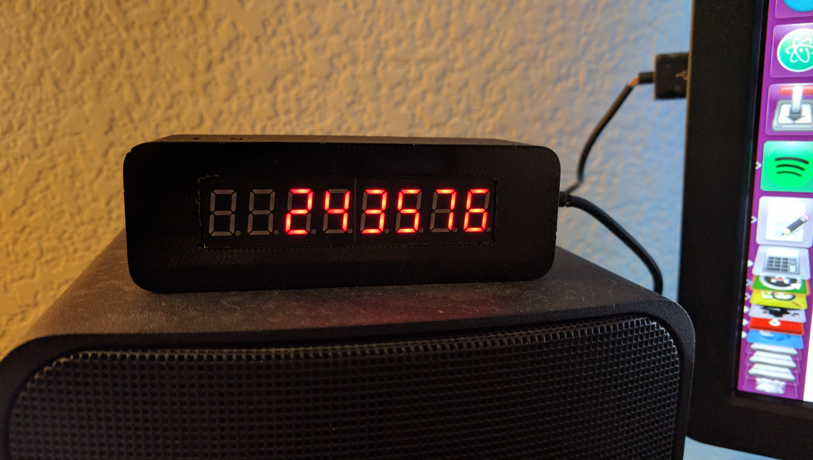
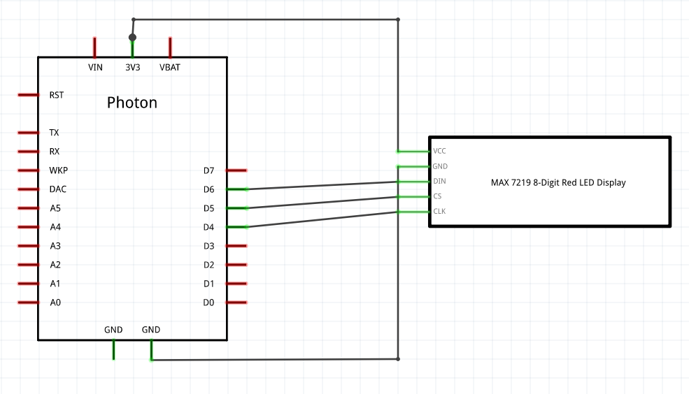
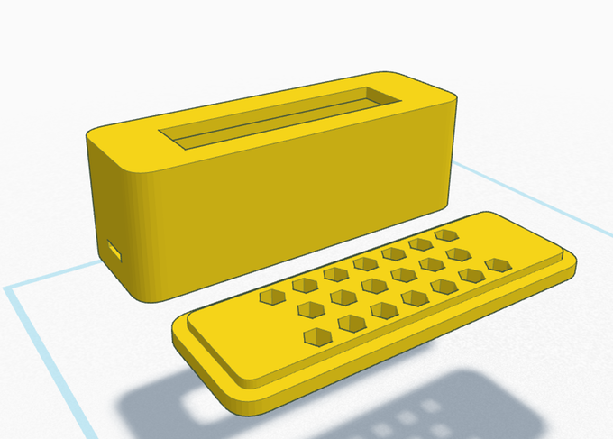

# Packagist Counter - Client

All of the code, components, wiring, etc. needed to build the client device.

**You can find a full write-up of the project here: <https://www.hackster.io/colinodell/packagist-download-counter-e1a263>**

## Hardware

### Components

You'll need the following parts to build this device:

- [Particle Photon](https://www.particle.io/products/hardware/photon-wifi-dev-kit)
- [MAX7219 8-Digit Red LED Display Module](http://www.ebay.com/sch/i.html?_from=R40&_trksid=p2050601.m570.l1313.TR0.TRC0.H0.XMAX7219+8-Digit+Red+LED+Display+Module.TRS0&_nkw=MAX7219+8-Digit+Red+LED+Display+Module&_sacat=0)
- USB-A to Micro-USB Cable
- Solder
- Wires

### Wiring

Wiring is very straight-forward - simply make the following connections from the LED display to the Photon:

 - `VCC` to `3V3`
 - `GND` to `GND`
 - `DIN` to `D6`
 - `CS` to `D5`
 - `CLK` to `D4`

### Enclosure

I've designed a 3D-printable case to house the components - see [case.stl](case.stl).

If you don't have a 3D printer, you can use a service like [3D Hubs](https://www.3dhubs.com/) to find someone nearby who can print it for you.

There isn't much tolerance in the LED screen opening, so you might need to use a Dremel to widen it slightly if your display doesn't fit.

## Software

The C code can be found in [packagist-counter.ino](packagist-counter.ino).  Upload this to the [Particle Build online IDE](https://build.particle.io/) and make sure to include the dependency below.

### Dependencies

This code relies on the [LedControl-MAX7219-MAX7221](https://github.com/chrisloris/LedControl-MAX7219-MAX7221) library. Make sure you've included this in your project dependencies.

### Webhook

The Packagist API returns a large JSON object - it's too large for the Particle to digest with a single request.  Handling these large multi-page responses would be a huge pain, so instead we've got a simple script [count.php](count.php) which parses out just the download count. Point the webhook to this file and you're good to go :)

