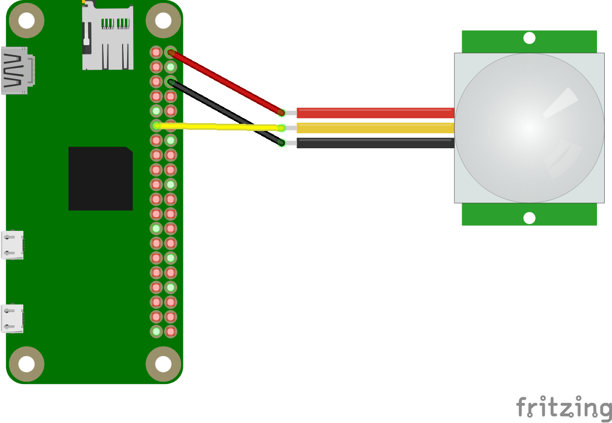
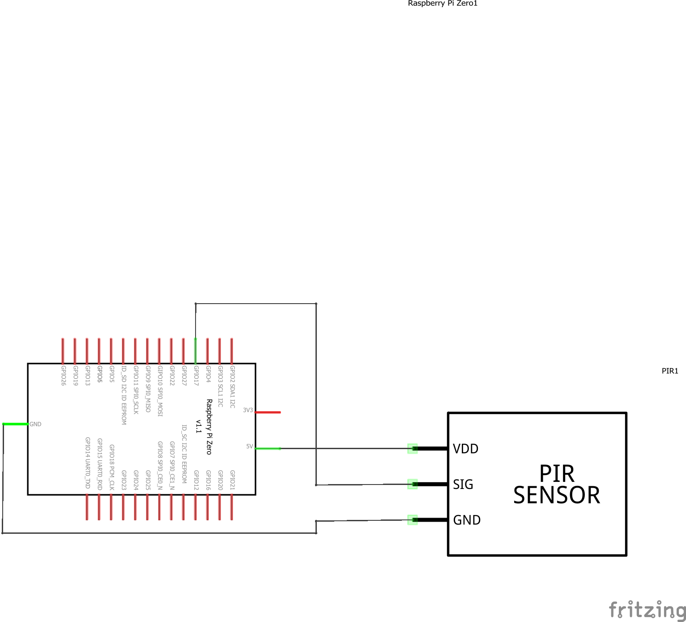

# PHP Conference Room Status Slack Demo

This demo shows how to use PHP to detect motion (using a PIR sensor) and send Slack messages to indicate whether a conference room is in use.

## Hardware

- Raspberry Pi Zero (any Pi should work)
- PIR Sensor (cheap one from Ebay)

## Schematics

