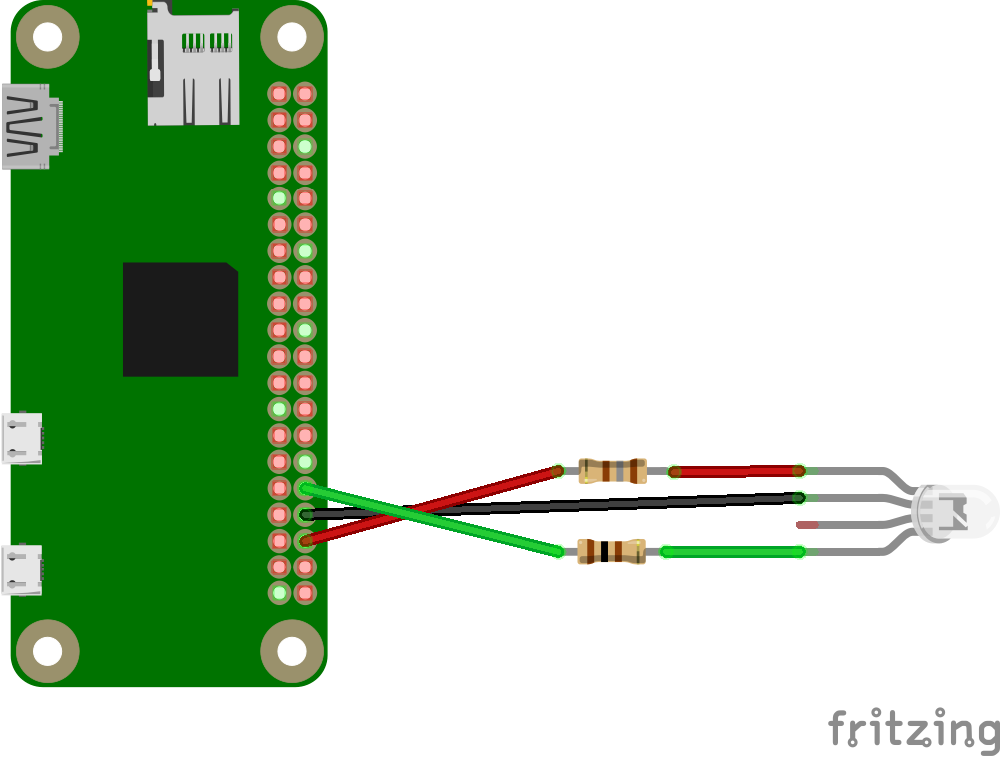
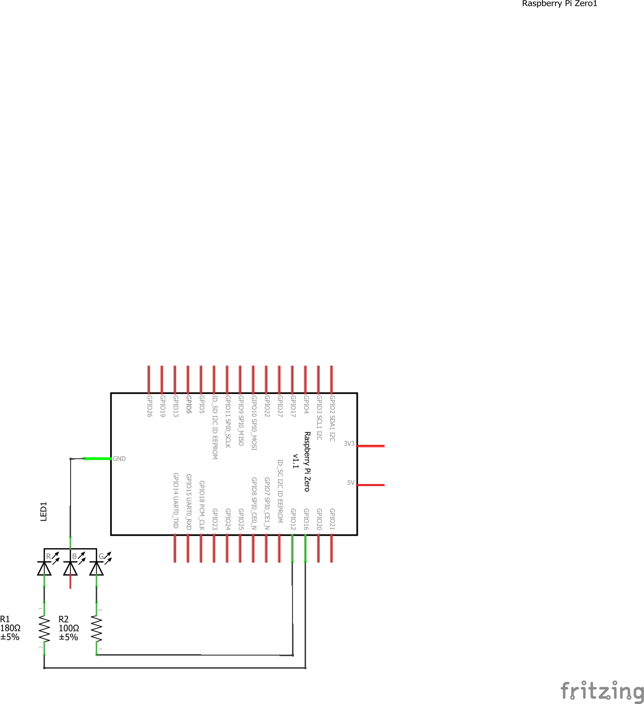

# PHP Uptime Status Demo

This demo shows how to use PHP to control an RGB LED to display whether a website is up (online) or down (offline).

## Hardware

- Raspberry Pi Zero (any Pi should work)
- 5mm RGB LED (common cathode)

## Schematics

